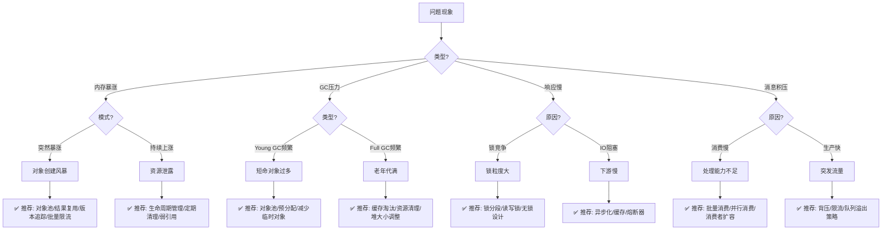
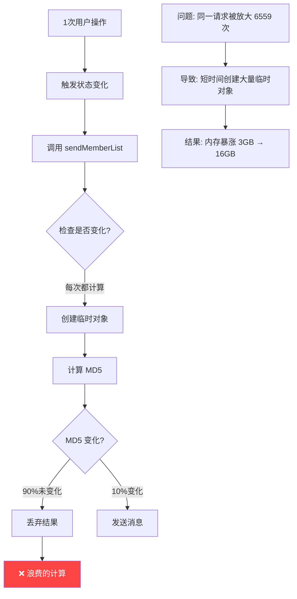
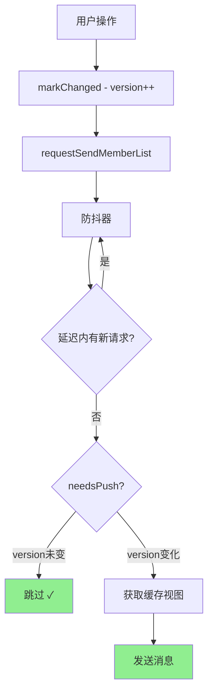

# 性能问题排查 Skill (Performance Troubleshoot)

分析和解决性能与资源问题，包含自动化的多轮审查，确保方案安全、正确、健壮。

**适用场景**: 内存暴涨、OOM、GC 频繁、响应慢、CPU 高、消息积压、资源泄露等。

## Quick Start

```
1. 问题分析 → 2. 方案设计 → 3. 多轮审查 → 4. 文档完善 → 5. 最终交付
```

## Instructions

### 阶段一：问题分析

**0. 渐进式信息收集** (分轮引导)

采用多轮对话方式收集信息，避免一次性问太多问题：

**第 1 轮 - 核心问题**
```
请描述您遇到的问题:
□ 内存问题 (内存暴涨/OOM/GC频繁)
□ 性能问题 (响应慢/CPU高/吞吐低)
□ 稳定性问题 (超时/错误率高/服务不可用)
□ 其他 (请描述)
```

**第 2 轮 - 根据回答追问**

| 第1轮回答 | 追问内容 |
|-----------|----------|
| 内存问题 | 是突然暴涨还是持续上涨? 是否有OOM日志? |
| 性能问题 | 是全部慢还是特定接口慢? 峰值QPS多少? |
| 稳定性问题 | 是持续不可用还是偶发? 有无依赖服务故障? |

**第 3 轮 - 资料收集**
```
请提供以下信息 (有什么提供什么，没有可跳过):
□ 日志文件路径
□ 监控截图 (内存/CPU曲线)
□ 代码目录
□ 配置文件
```

---

**1. 症状→诊断→处方决策树**

根据问题现象，自动推荐优化模式:



**2. 快速诊断表**

| 症状 | 可能原因 | 推荐模式 | 检查要点 |
|------|----------|----------|----------|
| 内存突然暴涨 | 短时间大量对象创建 | 对象池、批量限流、结果复用 | CHECKLIST 5.5 |
| 内存持续上涨 | 资源泄露 | 生命周期管理、定期清理 | CHECKLIST 7.4 |
| GC 频繁 | 临时对象多 | 对象池、预分配 | CHECKLIST 5.6 |
| 响应慢(锁) | 锁粒度大 | 锁分段、读写锁 | CHECKLIST 2 |
| 响应慢(IO) | 下游阻塞 | 异步化、熔断、缓存 | CHECKLIST 3 |
| CPU 高 | 重复计算 | 缓存、版本追踪 | CHECKLIST 2.1 |
| 消息积压 | 消费速度不足 | 批量消费、背压 | CHECKLIST 4 |
| 连接耗尽 | 连接泄露 | 连接池管理、超时 | CHECKLIST 3.4 |

---

**3. 收集问题数据**
   - 峰值 QPS/TPS
   - 响应时间分布 (P50/P99)
   - 资源使用率 (CPU/内存/连接数/队列深度)
   - 错误率、超时率、拒绝率

**4. 识别瓶颈类型**

   | 类型 | 表现 | 常见原因 |
   |------|------|----------|
   | **CPU 瓶颈** | CPU 高，响应慢 | 计算密集、锁竞争、GC |
   | **内存瓶颈** | GC 频繁，OOM | 对象创建过多、泄露 |
   | **IO 瓶颈** | 线程阻塞，超时多 | 数据库慢、网络延迟 |
   | **并发瓶颈** | 吞吐受限 | 锁粒度大、串行化 |
   | **网络瓶颈** | 错误率高，超时 | 带宽不足、连接数限制 |
   | **队列瓶颈** | 消息积压 | 消费速度 < 生产速度 |

**5. 根因分析**
   - 绘制请求链路图 (Mermaid)
   - 标注热点和放大效应
   - 识别级联失败风险
   - 量化问题影响


### 阶段二：方案设计

**通用优化模式** (根据问题选择适用的):

#### 2.1 性能优化模式

| 模式 | 适用场景 | 效果 |
|------|----------|------|
| **请求合并 (Debouncing)** | 高频重复请求 | 减少 90%+ 调用 |
| **结果缓存 (Caching)** | 重复计算/查询 | 减少 80%+ 计算 |
| **结果复用 (Sharing)** | 多用户相同结果 | 减少 95%+ 重复 |
| **批量处理 (Batching)** | 小请求累积 | 减少 IO 次数 |
| **连接池 (Pooling)** | 连接创建开销 | 减少连接时间 |
| **版本追踪 (Versioning)** | 变化检测 | O(1) 判断 |

#### 2.2 锁竞争优化模式

| 模式 | 适用场景 | 效果 |
|------|----------|------|
| **锁分段 (Lock Striping)** | 热点数据竞争 | 降低锁粒度 |
| **读写分离 (RWLock)** | 读多写少 | 提高读并发 |
| **无锁设计 (Lock-free)** | 极高并发 | CAS/原子类 |
| **乐观锁 (Optimistic)** | 冲突少 | 减少锁持有时间 |
| **异步化 (Async)** | IO 密集 | 释放线程 |

#### 2.3 故障处理模式

| 模式 | 适用场景 | 效果 |
|------|----------|------|
| **超时控制 (Timeout)** | IO 操作 | 防止无限等待 |
| **重试机制 (Retry)** | 暂时性故障 | 指数退避 |
| **熔断器 (Circuit Breaker)** | 依赖故障 | 快速失败 |
| **舱壁隔离 (Bulkhead)** | 资源隔离 | 故障不扩散 |
| **降级策略 (Fallback)** | 服务不可用 | 备选方案 |

#### 2.4 流量控制模式

| 模式 | 适用场景 | 效果 |
|------|----------|------|
| **限流 (Rate Limiting)** | 突发流量 | 令牌桶/漏桶 |
| **背压 (Backpressure)** | 消息积压 | 反向压力传递 |
| **负载均衡 (Load Balancing)** | 请求分发 | 均匀分布 |
| **优雅降级 (Graceful Degradation)** | 过载保护 | 丢弃低优先级 |
| **队列溢出处理 (Queue Overflow)** | 队列满 | 拒绝/丢弃策略 |

#### 2.5 Actor 并发模式 (Akka/Erlang/Virtual Threads)

| 模式 | 适用场景 | 效果 |
|------|----------|------|
| **消息传递 (Message Passing)** | 状态隔离 | 无锁并发 |
| **Actor 分片 (Sharding)** | 大量实体 | 分布式扩展 |
| **Mailbox 管理** | 消息堆积 | 有界/优先级队列 |
| **监督策略 (Supervision)** | 故障恢复 | 重启/停止/升级 |
| **背压信号 (Backpressure)** | 速率不匹配 | 反向压力 |

#### 2.6 长连接管理模式 (WebSocket/SSE/gRPC Stream)

| 模式 | 适用场景 | 效果 |
|------|----------|------|
| **心跳检测 (Heartbeat)** | 连接保活 | 及时发现断连 |
| **重连机制 (Reconnection)** | 网络抖动 | 指数退避重连 |
| **连接池管理 (Connection Pool)** | 资源复用 | 减少握手开销 |
| **广播优化 (Broadcast)** | 多用户推送 | 减少重复序列化 |
| **会话管理 (Session)** | 用户状态 | 生命周期清理 |

#### 2.7 资源突增防护模式 (短时间大批量创建)

| 模式 | 适用场景 | 效果 |
|------|----------|------|
| **对象池 (Object Pool)** | 频繁创建销毁 | 复用对象，减少 GC |
| **批量创建限流** | 突发大量请求 | 限制创建速率 |
| **延迟初始化 (Lazy Init)** | 非必需对象 | 按需创建 |
| **预分配 (Pre-allocation)** | 已知容量 | 避免扩容开销 |
| **弱引用缓存 (WeakReference)** | 大对象缓存 | GC 可回收 |
| **零拷贝 (Zero-copy)** | 大数据传输 | 减少复制 |
| **不可变对象 (Immutable)** | 共享数据 | 安全复用 |

---

### 诊断工具推荐

根据问题类型，推荐使用以下工具:

| 问题类型 | 推荐工具 | 用途 |
|----------|----------|------|
| **内存问题** | jmap, MAT, VisualVM | heap dump 分析 |
| **CPU 问题** | async-profiler, arthas | 火焰图、热点方法 |
| **线程问题** | jstack, arthas | thread dump 分析 |
| **GC 问题** | GCViewer, GCEasy | GC 日志分析 |
| **在线诊断** | arthas | 动态追踪、热修复 |

**常用诊断命令**:

```bash
# 1. Heap Dump
jmap -dump:format=b,file=heap.hprof <pid>

# 2. Thread Dump
jstack <pid> > thread.dump

# 3. GC 日志
java -Xlog:gc*:file=gc.log:time,uptime:filecount=5,filesize=10M

# 4. 火焰图 (async-profiler)
./profiler.sh -d 30 -f flamegraph.html <pid>

# 5. Arthas 在线诊断
java -jar arthas-boot.jar
> dashboard          # 实时监控
> thread -n 3        # 最忙的3个线程
> heapdump /tmp/dump.hprof  # 生成堆转储
> watch com.xxx.Service method '{params, returnObj}'  # 观察方法调用
```

---

### 反模式警示 (❌ 不要这样做)

#### ❌ 反模式 1: 锁内执行 IO 操作

```java
// ❌ 错误: 锁内执行网络调用
synchronized (lock) {
    String result = httpClient.get(url);  // 🔴 阻塞其他线程!
    cache.put(key, result);
}

// ✅ 正确: 先获取数据，再加锁
String result = httpClient.get(url);  // 锁外执行
synchronized (lock) {
    cache.put(key, result);  // 只保护写操作
}
```

#### ❌ 反模式 2: 循环内创建对象

```java
// ❌ 错误: 每次循环都创建对象
for (int i = 0; i < 10000; i++) {
    StringBuilder sb = new StringBuilder();  // 🔴 创建1万个对象!
    sb.append(data[i]);
    process(sb.toString());
}

// ✅ 正确: 复用对象
StringBuilder sb = new StringBuilder();
for (int i = 0; i < 10000; i++) {
    sb.setLength(0);  // 重置而非新建
    sb.append(data[i]);
    process(sb.toString());
}
```

#### ❌ 反模式 3: 无界队列

```java
// ❌ 错误: 无界队列，可能 OOM
ExecutorService executor = Executors.newFixedThreadPool(10);
// 内部使用 LinkedBlockingQueue 无界队列!

// ✅ 正确: 有界队列 + 拒绝策略
ExecutorService executor = new ThreadPoolExecutor(
    10, 10, 0L, TimeUnit.MILLISECONDS,
    new ArrayBlockingQueue<>(1000),  // 有界队列
    new ThreadPoolExecutor.CallerRunsPolicy()  // 背压
);
```

#### ❌ 反模式 4: 双重检查锁错误实现

```java
// ❌ 错误: 没有 volatile
private static Instance instance;
if (instance == null) {
    synchronized (lock) {
        if (instance == null) {
            instance = new Instance();  // 🔴 可能看到未初始化完成的对象!
        }
    }
}

// ✅ 正确: 使用 volatile
private static volatile Instance instance;  // 添加 volatile
```

#### ❌ 反模式 5: subList 返回视图

```java
// ❌ 错误: subList 返回的是视图，不是副本
List<T> result = list.subList(0, 10);
return result;  // 🔴 原列表变化会影响 result!

// ✅ 正确: 创建副本
List<T> result = new ArrayList<>(list.subList(0, 10));
return result;
```

---

**对每个优化点，必须包含**:
- 问题描述 (数据支撑)
- 设计原理 (Mermaid 图)
- 完整代码 (可直接使用)
- 预期效果 (量化指标)

### 阶段三：多轮审查

**必须对每个代码块进行以下检查，发现问题立即修复**:

#### 3.1 并发安全
```
□ 原子性: synchronized/锁保护完整操作
□ 可见性: volatile/原子类使用正确
□ 竞态条件: 检查-执行模式是否原子
□ 死锁: 锁顺序是否一致、有无超时
```

#### 3.2 锁竞争
```
□ 锁粒度: 是否过大导致串行化
□ 锁持有时间: 锁内是否有 IO/耗时操作
□ 热点锁: 是否需要锁分段
□ 读写比: 是否应该用读写锁
```

#### 3.3 IO/网络异常
```
□ 超时设置: 所有 IO 操作是否有超时
□ 重试机制: 是否有指数退避
□ 熔断保护: 是否有熔断器
□ 连接管理: 连接池配置是否合理
□ 资源释放: finally/defer 是否关闭资源
```

#### 3.4 消息积压
```
□ 背压机制: 是否有反向压力
□ 队列容量: 是否有上限
□ 溢出策略: 满时如何处理
□ 消费速度: 是否可扩容消费者
□ 优先级: 是否支持优先级处理
```

#### 3.5 资源耗尽
```
□ 线程池满: 拒绝策略是否合理
□ 连接池满: 等待超时是否设置
□ 内存不足: 是否有限制/降级
□ 磁盘空间: 日志/缓存是否有清理
```

#### 3.6 级联失败
```
□ 依赖隔离: 是否使用舱壁模式
□ 失败传播: 是否会引起雪崩
□ 超时传递: 是否设置全链路超时
□ 健康检查: 是否有依赖探活
```

#### 3.7 资源管理
```
□ 线程池: 有关闭方法、大小合理
□ 连接池: 有归还/关闭逻辑
□ 缓存: 有失效/淘汰机制
□ 临时对象: 无泄露风险
```

#### 3.8 配置与边界
```
□ 参数校验: 无效值有处理
□ 空值处理: null/空集合安全
□ 边界条件: 首次/极值正确
```

### 阶段四：文档完善

最终文档必须包含 (使用 [TEMPLATE.md](TEMPLATE.md)):

1. **问题背景** - 数据表格 + 链路图
2. **核心架构** - 优化后流程图
3. **优化点详解** - 每个优化的完整代码
4. **配置中心** - 配置项 + 默认值 + 说明
5. **监控体系** - 指标定义 + 告警规则
6. **日志设计** - 分级 + 采样 + 格式
7. **实施指南** - 前置条件 + 顺序 + 验证
8. **生命周期管理** - 资源清理
9. **故障处理** - 熔断、降级、重试策略
10. **压测方案** - 场景 + 指标

**输出格式强制规范**:

每个优化点必须包含以下内容，缺一不可:

| 必须项 | 格式要求 | 示例 |
|--------|----------|------|
| **问题描述** | 数据表格 | "峰值 2000 QPS，内存从 3GB 涨到 16GB" |
| **问题分析图** | Mermaid 流程图 | 展示问题发生的链路和放大效应 |
| **解决方案** | 推荐模式表格 | 对象池、结果复用、版本追踪 |
| **方案设计图** | Mermaid 架构图 | 展示优化后的数据流 |
| **完整代码** | 可直接复制使用 | 含注释、异常处理、生命周期 |
| **预期效果** | 量化指标 | "内存峰值降低 80%，GC 减少 90%" |
| **验证方法** | 测试/监控方式 | 压测脚本 + 监控指标 |

### 阶段五：最终交付

```
□ 并发安全已审查
□ 锁竞争已优化
□ IO/网络异常已处理
□ 消息积压已防护
□ 资源耗尽已处理
□ 级联失败已隔离
□ 资源管理已完善
□ 日志监控完整
□ 文档结构完整
□ 每个优化有完整图+代码+效果
```

## Examples

### Example 1: 内存暴涨优化 (完整示例)

#### 1.1 问题描述

| 指标 | 正常值 | 异常值 | 影响 |
|------|--------|--------|------|
| 内存 | 3.7 GB | 16.1 GB | OOM 风险 |
| GC 频率 | 10次/分钟 | 100次/分钟 | 应用卡顿 |
| 无效计算 | 0 | 178,755 次 | CPU 浪费 |

#### 1.2 问题分析图



#### 1.3 解决方案

| 优化模式 | 作用 | 预期效果 |
|----------|------|----------|
| **版本追踪** | O(1) 判断是否变化 | 减少 90% 无效计算 |
| **请求合并** | 合并高频请求 | 减少 95% 调用次数 |
| **结果复用** | 共享默认视图 | 减少 95% 对象创建 |

#### 1.4 方案设计图



#### 1.5 核心代码

```java
/**
 * 版本号管理器 - 替代脏标记和MD5比较
 */
public class VersionManager {
    private final AtomicLong currentVersion = new AtomicLong(0);
    private volatile long lastPushedVersion = -1;
    
    /** 标记变化 - O(1) */
    public void markChanged() {
        currentVersion.incrementAndGet();
    }
    
    /** 判断是否需要推送 - O(1) */
    public boolean needsPush() {
        return currentVersion.get() > lastPushedVersion;
    }
    
    /** 标记已推送 */
    public void markPushed() {
        lastPushedVersion = currentVersion.get();
    }
}
```

```java
/**
 * 自适应防抖器 - 合并高频请求
 */
@Component
public class AdaptiveDebouncer {
    private final ConcurrentHashMap<String, DebouncedTask> tasks = new ConcurrentHashMap<>();
    
    public void request(String key, Runnable action) {
        tasks.compute(key, (k, existing) -> {
            if (existing != null) {
                existing.cancel();  // 取消旧任务
            }
            return scheduleNew(key, action);  // 调度新任务
        });
    }
}
```

#### 1.6 预期效果

| 指标 | 优化前 | 优化后 | 改善 |
|------|--------|--------|------|
| 内存峰值 | 16.1 GB | < 4 GB | **75%↓** |
| GC 频率 | 100次/分钟 | 10次/分钟 | **90%↓** |
| 推送次数 | 178,755 | < 10,000 | **95%↓** |

#### 1.7 验证方法

```bash
# 压测命令
wrk -t10 -c100 -d60s http://localhost:8080/api/meeting/join

# 监控指标
curl http://localhost:8080/actuator/metrics/jvm.memory.used
curl http://localhost:8080/actuator/metrics/jvm.gc.pause
```

---

### Example 2: 消息队列消费优化
**方案**: 异步化 + 熔断器 + 连接池优化 + 超时控制
**效果**: P99 降至 50ms，故障隔离

### Example 2: 消息队列消费优化

**问题**: 消息积压 100 万+，消费速度跟不上
**方案**: 批量消费 + 背压 + 消费者扩容 + 优先级队列
**效果**: 积压清零，延迟 < 1s

### Example 3: 典型问题修复

**锁竞争优化**:
```java
// 问题: 全局锁，所有请求串行
private final Object lock = new Object();
synchronized (lock) { ... }

// 修复: 锁分段
private final ConcurrentHashMap<String, Object> lockMap = new ConcurrentHashMap<>();
Object segmentLock = lockMap.computeIfAbsent(key.hashCode() % 16, k -> new Object());
synchronized (segmentLock) { ... }
```

**熔断器模式**:
```java
// 使用 Resilience4j
CircuitBreaker circuitBreaker = CircuitBreaker.ofDefaults("backend");
Supplier<String> decorated = CircuitBreaker.decorateSupplier(circuitBreaker, 
    () -> backendService.call());
Try.ofSupplier(decorated)
    .recover(throwable -> "fallback");
```

**背压机制**:
```java
// 有界队列 + 拒绝策略
new ThreadPoolExecutor(
    coreSize, maxSize, keepAlive, TimeUnit.SECONDS,
    new ArrayBlockingQueue<>(1000),  // 有界队列
    new ThreadPoolExecutor.CallerRunsPolicy()  // 调用者执行=背压
);
```

**超时控制**:
```java
// 全链路超时
CompletableFuture.supplyAsync(() -> service.call())
    .orTimeout(500, TimeUnit.MILLISECONDS)
    .exceptionally(e -> fallback());
```

## Language Support

| 语言 | 并发原语 | 熔断/限流框架 |
|------|----------|--------------|
| **Java** | synchronized, Lock, Atomic* | Resilience4j, Sentinel |
| **Go** | goroutine, channel, sync | go-resilience, uber/ratelimit |
| **Python** | asyncio, threading | pybreaker, ratelimit |
| **Node.js** | async/await, Worker | opossum, bottleneck |

## Resources

- [CHECKLIST.md](CHECKLIST.md) - 完整审查检查清单
- [TEMPLATE.md](TEMPLATE.md) - 文档模板
