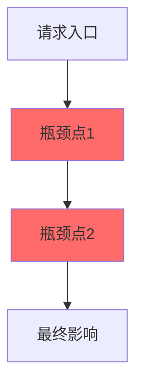
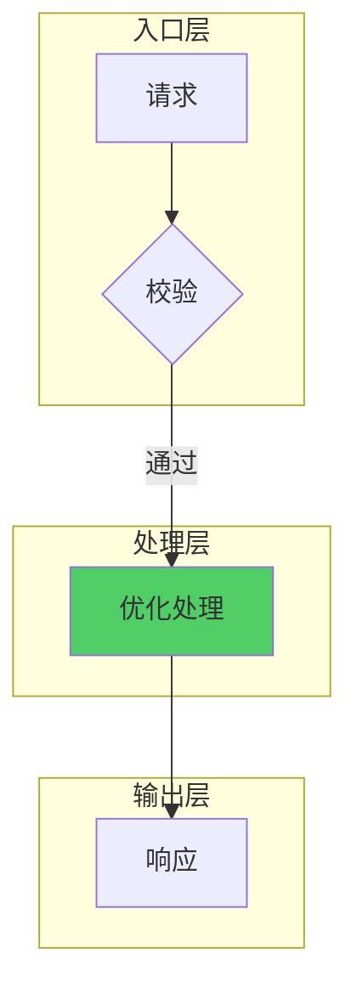
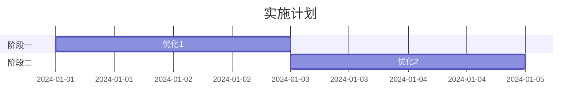

# [系统名称] 高并发优化方案

> **版本**: 1.0  
> **日期**: YYYY-MM-DD  
> **目标**: [优化目标，如：P99 响应时间 < 100ms]

---

## 一、问题背景

### 1.1 问题现象

| 指标 | 当前值 | 目标值 | 差距 |
|------|--------|--------|------|
| 峰值 QPS | | | |
| P99 延迟 | | | |
| 错误率 | | | |
| CPU 使用率 | | | |
| 内存使用 | | | |

### 1.2 瓶颈分析



### 1.3 关键数据

```
[监控数据或日志分析结果]
```

---

## 二、核心架构

### 2.1 优化后流程



### 2.2 优化点总览

| # | 优化点 | 类型 | 预期效果 |
|---|--------|------|----------|
| 1 | | | |
| 2 | | | |

---

## 三、优化点详解

### 3.1 [优化点名称]

#### 问题
```
[问题描述和数据]
```

#### 设计

```mermaid
[设计图]
```

#### 实现

```[language]
// [语言: java/go/python/javascript]
[完整代码]
```

#### 效果
```
优化前: [指标]
优化后: [指标]
```

---

## 四、配置中心

### 4.1 配置项

```yaml
optimization:
  enabled: true
  # [其他配置项及说明]
```

### 4.2 配置说明

| 配置项 | 类型 | 默认值 | 说明 |
|--------|------|--------|------|
| | | | |

---

## 五、监控体系

### 5.1 关键指标

| 指标名 | 类型 | 说明 |
|--------|------|------|
| `xxx_total` | Counter | 请求总数 |
| `xxx_duration` | Histogram | 延迟分布 |

### 5.2 告警规则

| 告警 | 条件 | 级别 |
|------|------|------|
| | | |

### 5.3 日志规范

| 级别 | 场景 | 控制 |
|------|------|------|
| ERROR | 异常失败 | 不限制 |
| WARN | 降级触发 | 限流 |
| INFO | 统计汇总 | 定时 |
| DEBUG | 请求详情 | 采样 |

---

## 六、实施指南

### 6.0 前置条件

| 依赖 | 说明 | 状态 |
|------|------|------|
| | | □ |

### 6.1 实施步骤



### 6.2 验证标准

| 阶段 | 指标 | 目标 |
|------|------|------|
| | | |

### 6.3 回滚方案

```
# 紧急回滚
optimization.enabled=false
```

---

## 七、资源管理

### 7.1 生命周期

```[language]
// 资源清理代码
```

---

## 八、降级策略

### 8.1 降级实现

```[language]
// 降级逻辑代码
```

---

## 九、压测方案

### 9.1 场景

| # | 场景 | 并发 | 持续时间 |
|---|------|------|----------|
| 1 | 基准测试 | 100 | 5min |
| 2 | 峰值测试 | 1000 | 10min |
| 3 | 极限测试 | 5000 | 5min |

### 9.2 预期结果

| 指标 | 优化前 | 优化后 | 提升 |
|------|--------|--------|------|
| QPS | | | |
| P99 | | | |
| 错误率 | | | |

---

*更新时间: YYYY-MM-DD HH:mm*
