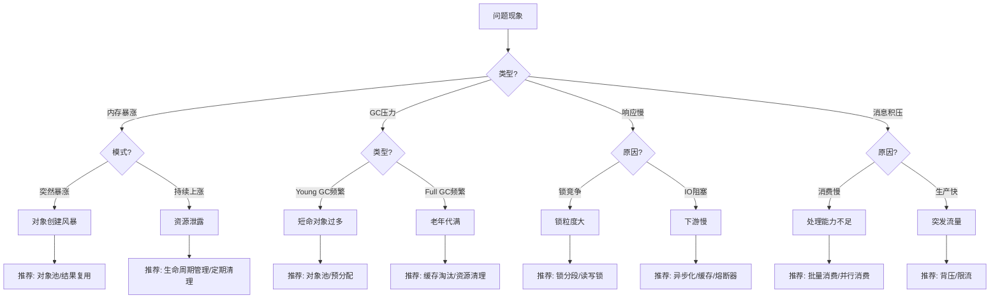
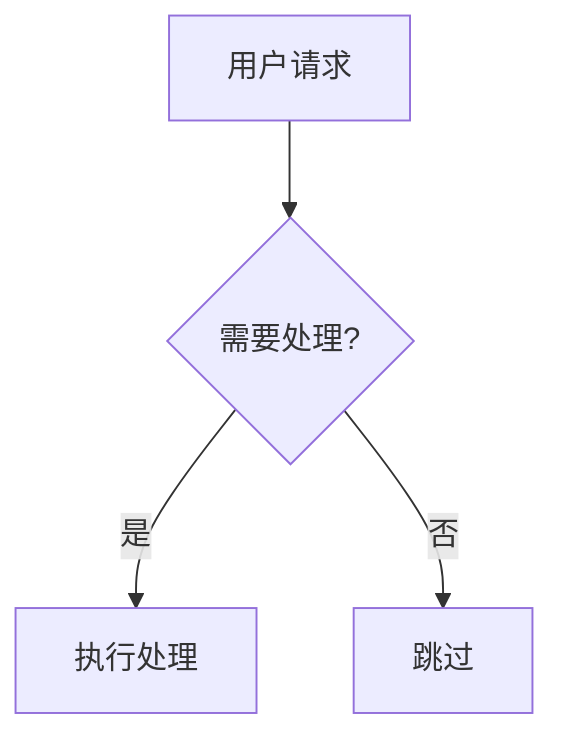

# 性能问题诊断参考

详细的诊断决策树、反模式警示、优化模式等参考内容。

---

## 症状→诊断→处方决策树

根据问题现象，推荐优化模式：



---

## 快速诊断表

| 症状 | 可能原因 | 推荐模式 |
|------|----------|----------|
| 内存突然暴涨 | 短时间大量对象创建 | 对象池、批量限流、结果复用 |
| 内存持续上涨 | 资源泄露、缓存无上限 | 生命周期管理、WeakReference |
| Young GC 频繁 | 短命对象过多 | 对象复用、预分配 |
| Full GC 频繁 | 老年代对象过多 | 缓存淘汰、大对象处理 |
| 响应时间长尾 | 锁竞争、IO 阻塞 | 锁优化、异步化 |
| CPU 使用率高 | 计算密集、自旋锁 | 批量处理、锁优化 |
| 消息积压 | 消费能力不足 | 批量消费、背压控制 |

---

## 反模式警示

### 反模式 1: 锁内执行 IO 操作

```java
// [错误] 锁内执行网络调用
synchronized (lock) {
    String result = httpClient.get(url);  // 阻塞其他线程!
    cache.put(key, result);
}

// [正确] 先获取数据，再加锁
String result = httpClient.get(url);  // 锁外执行
synchronized (lock) {
    cache.put(key, result);  // 只保护写操作
}
```

### 反模式 2: 循环内创建对象

```java
// [错误] 每次循环都创建对象
for (int i = 0; i < 10000; i++) {
    StringBuilder sb = new StringBuilder();  // 创建1万个对象!
    sb.append(data[i]);
    process(sb.toString());
}

// [正确] 复用对象
StringBuilder sb = new StringBuilder();
for (int i = 0; i < 10000; i++) {
    sb.setLength(0);  // 重置而非新建
    sb.append(data[i]);
    process(sb.toString());
}
```

### 反模式 3: 无界队列

```java
// [错误] 无界队列，可能 OOM
ExecutorService executor = Executors.newFixedThreadPool(10);
// 内部使用 LinkedBlockingQueue 无界队列!

// [正确] 有界队列 + 拒绝策略
ExecutorService executor = new ThreadPoolExecutor(
    10, 10, 0L, TimeUnit.MILLISECONDS,
    new ArrayBlockingQueue<>(1000),  // 有界队列
    new ThreadPoolExecutor.CallerRunsPolicy()  // 背压
);
```

### 反模式 4: 双重检查锁错误实现

```java
// [错误] 没有 volatile
private static Instance instance;
if (instance == null) {
    synchronized (lock) {
        if (instance == null) {
            instance = new Instance();  // 可能看到未初始化完成的对象!
        }
    }
}

// [正确] 使用 volatile
private static volatile Instance instance;  // 添加 volatile
```

### 反模式 5: subList 返回视图

```java
// [错误] subList 返回的是视图，不是副本
List<T> result = list.subList(0, 10);
return result;  // 原列表变化会影响 result!

// [正确] 创建副本
List<T> result = new ArrayList<>(list.subList(0, 10));
return result;
```

---

## Mermaid 语法规范

**避免语法错误的规则：**

1. **不要使用 emoji** - 禁止使用特殊符号，用文字替代
2. **特殊字符需要引号** - 包含括号、冒号的标签用双引号包裹
3. **中文标签加引号** - 更安全

**正确示例：**


---

## 诊断工具推荐

| 问题类型 | 推荐工具 | 用途 |
|----------|----------|------|
| 内存问题 | jmap, MAT, async-profiler | 堆分析、内存泄露 |
| CPU问题 | async-profiler, arthas | 火焰图、热点方法 |
| 锁问题 | jstack, arthas | 线程分析、死锁检测 |
| GC问题 | GC日志, GCViewer | GC分析 |
